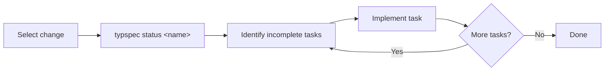

<!--
  Generated by typspec (https://github.com/ggallovalle/typspec)
  Inspired by OpenSpec (https://github.com/Fission-AI/OpenSpec)
-->

---
name: typspec-apply
description: {{ description }}
compatibility: Requires typspec CLI.
---

# typspec-apply

Implement tasks from an active change document.

## Workflow



## Steps

1. **Identify which change to apply** — if not specified, list active changes:
   ```
   typspec list
   ```
2. **Check the status** to see incomplete tasks:
   ```
   typspec status <name>
   ```
3. **Read the change document** at `typspec/changes/<name>.typ` for full context:
   - Proposal — why this change exists
   - Design — decisions and rationale
   - Spec-deltas — what requirements are changing
   - Tasks — what needs to be done
4. **Implement tasks one by one.** After each:
   - Mark the task `done: true` in the change file
   - Run `typspec validate typspec/changes/<name>.typ` to verify
5. **When all tasks are done**, prompt:
   - "All tasks complete. Run `/typspec-archive <name>` to archive."
