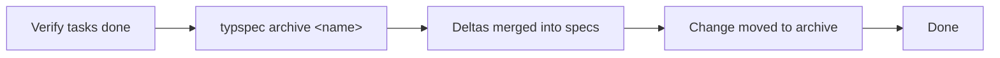

<!--
  Generated by typspec (https://github.com/ggallovalle/typspec)
  Inspired by OpenSpec (https://github.com/Fission-AI/OpenSpec)
-->

---
name: typspec-archive
description: {{ description }}
compatibility: Requires typspec CLI.
---

# typspec-archive

Archive a completed change. Merges spec-deltas into target specs, then
moves the change file to the archive directory.

## Workflow



## Steps

1. **Verify all tasks are complete:**
   ```
   typspec status <name>
   ```
2. **Run the archive command:**
   ```
   typspec archive <name>
   ```
   This:
   - Queries the change file for spec-deltas
   - Merges ADDED/MODIFIED/REMOVED requirements into target specs
   - Moves the change file to `typspec/archive/`
3. **Verify specs still compile:**
   ```
   typspec validate typspec/specs/<spec>.typ
   ```
4. **Commit the changes** (spec files + archive):
   ```
   git add -A && git commit -m "feat: &lt;change description&gt;"
   ```
