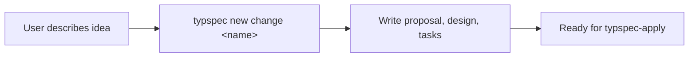

<!--
  Generated by typspec (https://github.com/ggallovalle/typspec)
  Inspired by OpenSpec (https://github.com/Fission-AI/OpenSpec)
-->

---
name: typspec-propose
description: {{ description }}
compatibility: Requires typspec CLI.
---

# typspec-propose

Create a new change — propose, design, and plan in one step.

## Workflow



## Steps

1. **Understand what they want to build.** Ask clarifying questions if needed.
2. **Create the change:**
   ```
   typspec new change <kebab-case-name>
   ```
3. **Fill the change document** at `typspec/changes/<name>.typ`:
   - Write the proposal (motivation, scope)
   - Capture design decisions
   - Add spec-deltas (requirements with `action:`)
   - List implementation tasks
4. **Verify it compiles:**
   ```
   typspec validate typspec/changes/<name>.typ
   ```
5. **Show a summary** of what was created and prompt:
   - "Ready to implement. Run `/typspec-apply` or `typspec status <name>`"
